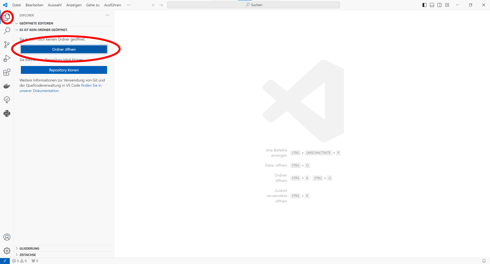
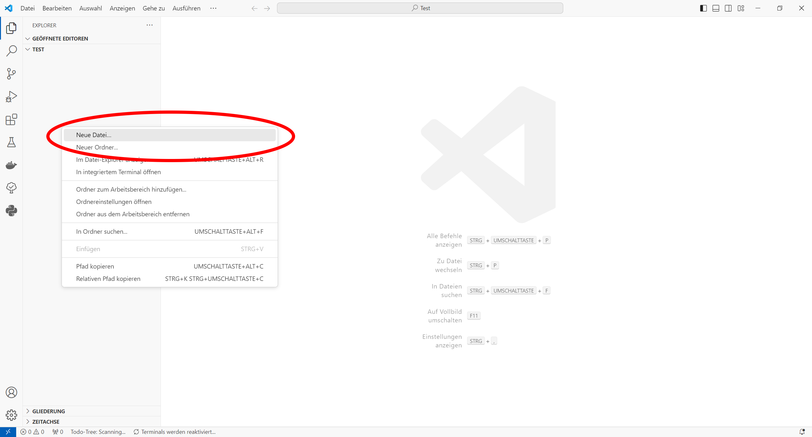
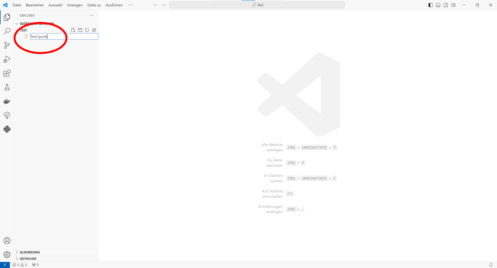
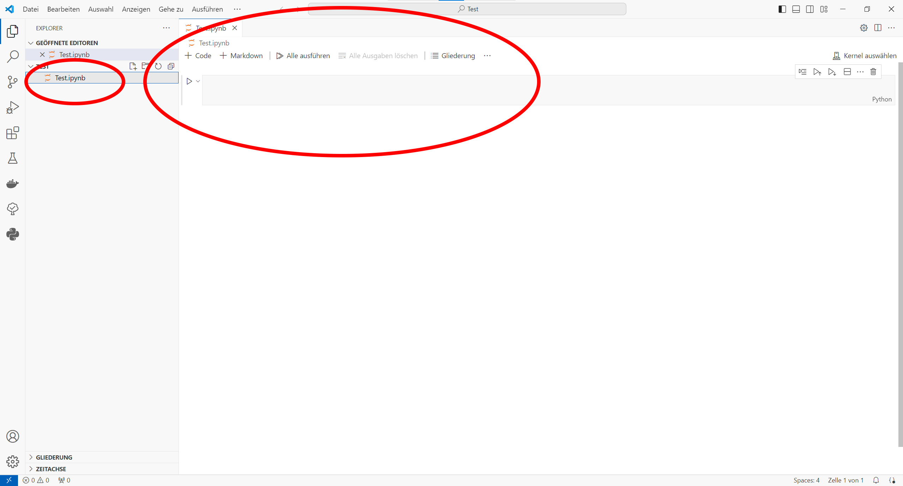

# 4. Jupyter Kernel installieren

## 4.1. Ordner öffnen

Zunächst öffnen wir einen Projektordner in Visual Studio Code, um darin ein Jupyter Notebook anlegen zu können. Dazu gehen wir in Visual Studio Code auf den sogenannten Explorer-Tab. Der Explorer-Tab müsste zwei blaue Knöpfe mit den Aufschriften ``Ordner öffnen`` und ``Repository klonen`` zeigen. Drücke den ersten der beidne Knöpfe und wähle dein gewünschtes Arbeitsverzeichnis aus.

## 4.2. Autoren vertrauen

Wenn du ein Arbeitsverzeichnis das erste mal mit Visual Studio Code öffnest, wirst du gefragt, ob die Inhalte des Arbeitsverzeichnisses vertrauenswürdig sind. Diese Frage ist wichtig, weil Arbeitsverzeichnisse in der Regel Quelltext von Computerprogrammen enthalten, die **potenziell schädlich** sein können. Wenn du den Ordner für dein Arbeitsverzeichnis gerade neu erstellt hast, sollte das Verzeichnis keinen schädlichen Quelltext enthalten. Somit kannst du in den **vertrauenswürdigen Modus** wechseln. Wenn du dir nicht sicher bist, wechsle lieber in den **eingeschränkten Modus**.

## 4.3. Jupyter Notebook erstellen

Wenn die das Arbeitsverzeichnis erfolgreich mit Visual Studio Code geöffnet hast, kannst du dein erstes Jupyter Notebook erstellen. Drücke dazu im Explorer-Tab mit der rechten Maustaste auf die freie graue Fläche. Ein Kontextmenü müsste sich öffnen. Wähle im Kontextmenü den Menüpunkt ``Neue Datei...``.

Ein neuer Eintrag im Explorer-Tab müsste daraufhin erscheinen. Nun kannst du den Namen deiner neuen Datei eingeben. Visual Studio Code erkennt anhand der Dateiendung, um welche Art von Datei es sich handelt. Jupyter Notebooks nutzen die Dateiendung ``.ipynb``. Gib nun einen beliebigen Dateinamen mit dieser Endung ein (z.B. ``Test.ipynb``). Stelle anschließend sicher, dass du die Endung richtig geschrieben hast.

Nachdem du den Dateinamen mit der Enter-Taste bestätigt hast, erkennt Visual Studio Code den Dateitypen und öffnet den zugehörigen Editor. Wenn du die Visual Studio Code Erweiterung Jupyter installiert hast, müsste der Editor wie im folgenden Screenshot dargestellt aussehen. Was die einzelnen Steuerelemente des Editors bedeuten, lernen  wir noch im Verlauf des Kurses.

## 4.4. Code Block ausführen

Um den Jupyter Kernel für die Programmiersprache Python zu installieren, können wir im Jupyter Notebook den leeren Code Block ausführen. Neben dem Code Block wird ein Play-Knopf dargestellt, den man dafür drücken kann. Jupyter wird nun versuchen, eine geeignete Ausführungsumgebung zu finden und diese einzurichten.

## 4.5. Jupyter Kernel installieren

Als Ausführungsumgebung kannst du die Python Installation verwenden, die du im ersten Schritt erstellt hast. Wenn du mit dieser Installation noch nie ein Jupyter Notebook ausgeführt hast, musst du einige Pakete nachinstallieren, die im Standard von Python nicht enthalten sind. Die Visual Studio Code Erweiterung Jupyter fragt dich, ob diese Pakete nachinstalliert werden dürfen. Wenn du den Knopf mit der Aufschrift ``Installieren`` drückst, werden die notwendigen Pakete auf deinen Computer heruntergelanden und in deine Python Umgebung installiert. Danach kannst du mit dieser Python Umgebung Jupyter Notebooks ausführen.

## Nächster Schritt

**[Lerneinheit 1 - Grundlegende Syntax](../../Lerneinheiten/Einheit_01/README.ipynb)**